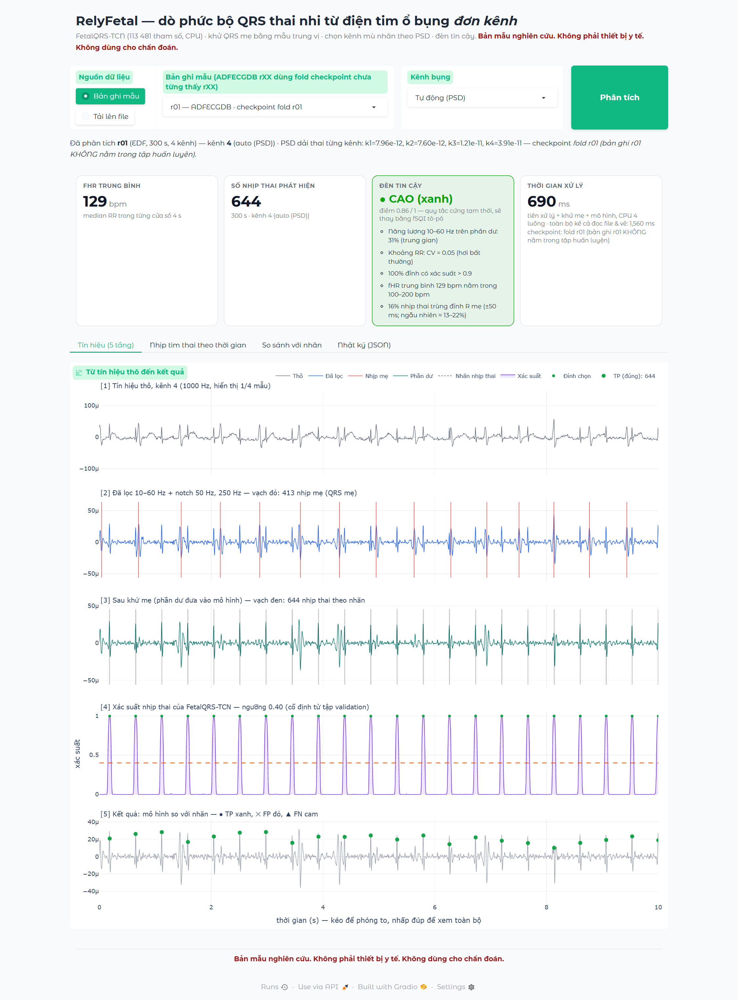
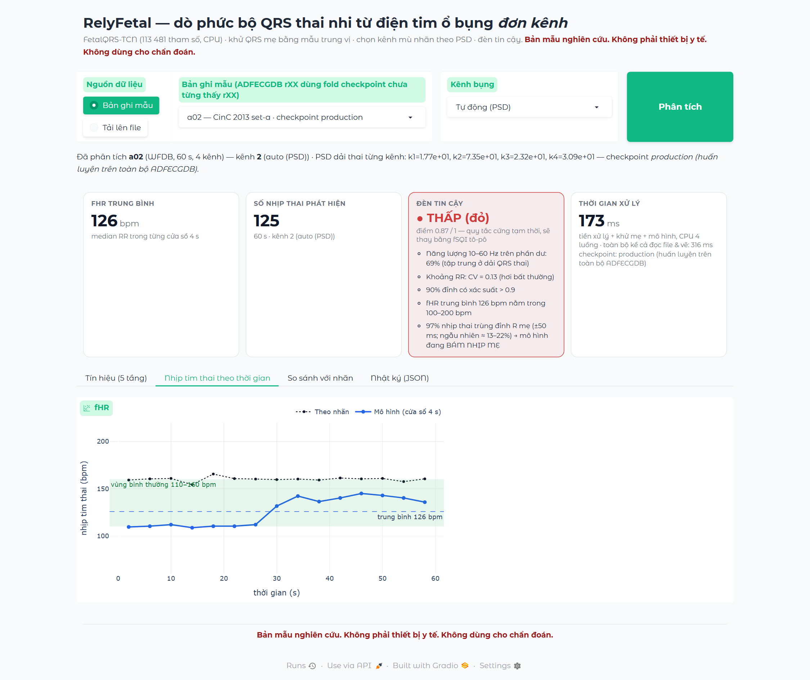

# RelyFetal — demo dò phức bộ QRS thai nhi từ điện tim ổ bụng đơn kênh

> **Bản mẫu nghiên cứu. Không phải thiết bị y tế. Không dùng cho chẩn đoán.**

Demo web một trang (Gradio + Plotly, chạy cục bộ trên CPU) bao bọc đúng pipeline chuẩn của
`model/fqrs_model.py` — *tiền xử lý → khử QRS mẹ → FetalQRS-TCN → chọn đỉnh* — và bổ sung:
chọn kênh mù nhãn theo PSD, chuỗi nhịp tim thai theo cửa sổ 4 s, đối chiếu với nhãn (nếu có)
và một **đèn tin cậy** không cần nhãn với hai chế độ — *học* (GBM trên 12 chỉ số cổ điển của từng đoạn 4 s, `fsqi/gate.py`, mặc định)
và *luật* (quy tắc cứng) — kiểm chứng trên 32 bản ghi có nhãn (mục 4).

## 1. Cách chạy

```bash
pip install gradio plotly            # đã kiểm với gradio 6.26.0, plotly 7.0.0 (Python 3.12.6, torch 2.13.0+cpu)
python demo/app.py                   # mở http://127.0.0.1:7860
```

| Biến môi trường | Ý nghĩa | Mặc định |
|---|---|---|
| `RELYFETAL_PORT` | cổng HTTP | `7860` |
| `RELYFETAL_AUTORUN` | `1` = mở trang là tự phân tích bản ghi đầu tiên (r01) | `1` |
| `PYTHONIOENCODING` | trên Windows nên đặt `utf-8` để in tiếng Việt ra console | — |

Dữ liệu mẫu được tìm qua `benchmark_dpss/_paths.py` (ADFECGDB r01/r04/r07/r08/r10 dạng EDF 1000 Hz;
CinC 2013 set-a a01..a10 dạng WFDB 1000 Hz). Không có dữ liệu mẫu thì vẫn chạy được với file tải lên.
Checkpoint: `model/checkpoints/fetalqrs_tcn_fold_rXX.pt` (dùng cho ADFECGDB rXX — **fold chưa từng thấy rXX**)
và `fetalqrs_tcn_production.pt` (mọi bản ghi khác, kể cả CinC 2013 = zero-shot).

**Tải lên file:** `.edf` (kèm `.edf.qrs` nếu có nhãn) · `.hea + .dat` (+ `.fqrs`) · `.csv` / `.npy` / `.txt`
(mảng K×N hoặc N×K; cần nhập fs) · nhãn tuỳ chọn dạng `.txt` mỗi dòng một chỉ số mẫu.

## 2. Cấu trúc

| Tệp | Vai trò |
|---|---|
| `core.py` | **Lõi xử lý, không phụ thuộc gradio.** Đọc bản ghi (EDF/WFDB/CSV/NPY/mảng) → 1000 Hz; `select_lead` (PSD Power-MF, mù nhãn); `analyze`/`analyze_record` gọi `M.preprocess`, `M.cancel_maternal`, `M.probability_series`, `M.pick_peaks` của `model/fqrs_model.py`; `fhr_series`; `match_with_lists` (ghép một-đối-một, ±50 ms, giống `M.match_events`); `confidence_rule` / `confidence_learned` (đèn tin cậy, hai chế độ — mục 4); `summary` (JSON). Không sửa gì trong `model/`. |
| `app.py` | Giao diện Gradio: hàng điều khiển (nguồn, bản ghi, kênh, nút *Phân tích*), 4 thẻ số, 4 tab (*Tín hiệu 5 tầng*, *Nhịp tim thai theo thời gian*, *So sánh với nhãn*, *Nhật ký JSON*). Chỉ dựng giao diện và vẽ Plotly; mọi tính toán ở `core.py`. Tự thích nghi Gradio 5/6 (`css`/`theme` chuyển sang `launch()` ở Gradio 6). |
| `test_core.py` | 10 kiểm thử pytest cho lõi (không cần gradio), gồm hai mốc bắt buộc chạy ở **cả hai** chế độ đèn (`luat` và `hoc`): r01 kênh 4 F1 > 99 & đèn *cao*; a02 đèn *không cao*. |
| `run_check.py` | `--mode hoc / luat / ca_hai`, `--threads N`, `--no-silesia`. Chạy lõi trên 32 bản ghi có nhãn (5 ADFECGDB + 10 CinC + 17 Silesia qua `model/silesia_loader.py`; chọn kênh tự động), chấm đèn ở cả hai chế độ → `results/demo_check_2modes.json` + `.log` — nguồn của bảng mục 4. JSON được ghi lại sau mỗi bản ghi. |
| `smoke_app.py` | Khởi động thử app không mở trình duyệt: HTTP 200, gọi thẳng `app.run()` với r01, gọi qua `gradio_client` API `/run` → `results/smoke_app.json`. |
| `screenshot.py` | Chụp màn hình giao diện thật bằng playwright/Chromium → `screenshots/`. |
| `results/` | `demo_check_2modes.json` / `.log` (32 bản ghi, hai chế độ đèn — mục 4), `demo_check.json` / `.log` (lần chạy 15 bản ghi mẫu, 4 luồng — nguồn số thời gian ở mục 2), `smoke_app.json` (mọi con số trong README lấy từ đây). |
| `screenshots/` | 6 ảnh PNG + `screenshots.json`. |
| `_uploads/` | thư mục tạm cho file tải lên (tự tạo, tự xoá khi tải file mới). |

**Thời gian xử lý** hiển thị trên thẻ = tiền xử lý + khử mẹ của kênh được chọn + mô hình + chọn đỉnh
(không tính đọc file và vẽ); CPU 4 luồng (`torch.set_num_threads(4)`). Bản ghi 300 s: ≈ 0,57–0,76 s;
bản ghi 60 s: ≈ 0,12–0,16 s (lần chạy sạch cuối, `results/demo_check.json`). Toàn bộ chu trình kể cả đọc EDF và dựng hình r01: ≈ 1,8–2,1 s (`results/smoke_app.json`).
Chế độ đèn *học* tốn thêm ≈ 11–23 ms mỗi đoạn 4 s (trung vị 15 ms; cột `gate_ms` trong `results/demo_check_2modes.json`, 2 luồng, máy bận),
tức ≈ 1–1,7 s cho bản ghi 300 s — hiển thị riêng cạnh điểm đèn, không tính vào thẻ thời gian xử lý.

## 3. Quy trình trong demo (những gì người xem thấy trên tab *Tín hiệu*)

1. **Tín hiệu thô** kênh bụng đã chọn (1000 Hz).
2. **Lọc 10–60 Hz + notch 50 Hz, 250 Hz**; vạch đỏ = đỉnh R mẹ do `cancel_maternal` tìm được.
3. **Phần dư sau khử mẹ** (mẫu trung vị) — chính là đầu vào của mô hình; vạch đen = nhãn nhịp thai (nếu có).
4. **Xác suất nhịp thai** của FetalQRS-TCN (113 481 tham số) và ngưỡng cố định từ tập validation.
5. **Kết quả**: ● TP (xanh), ✕ FP (đỏ), ▲ FN (cam) khi có nhãn; hoặc vạch xanh = nhịp mô hình phát hiện khi không có nhãn.

Chọn kênh *Tự động (PSD)*: khử mẹ trên cả 4 kênh, lấy kênh có đỉnh PSD mạnh nhất trong dải 1,8–3,0 Hz
(108–180 bpm) của đường bao phần dư — không dùng nhãn (sao chép từ `benchmark_dpss/blind_lead.py`).

## 4. Đèn tin cậy — hai chế độ (`confidence_mode`)

Đèn trả lời câu hỏi *"có nên tin chuỗi nhịp thai mà mô hình vừa đưa ra không"* mà **không dùng nhãn**.
Demo có hai chế độ, chọn trên giao diện (ô *Đèn tin cậy*) hoặc bằng `core.analyze_record(rec, confidence_mode=...)`:

| Chế độ | Cách tính | Nguồn / bằng chứng |
|---|---|---|
| **`hoc` (mặc định)** | Mỗi đoạn 4 s: 12 chỉ số cổ điển (SampEn, kurtosis, entropy phổ, tỉ số năng lượng 10–60 Hz, CV RR, tỉ lệ RR hợp lý, bSQI, số đỉnh, đỉnh PSD dải thai, τ ACF, xác suất trung bình tại đỉnh, xác suất cực đại) → HistGradientBoosting → `p_bad` = P(F1 đoạn < 80). Đoạn **xanh** nếu `p_bad` < 0,052, **đỏ** nếu > 0,540 (phân vị 85 % / 95 % của xác suất *ngoài fold* trên ADFECGDB), còn lại vàng. Bản ghi: > 30 % đoạn đỏ ⇒ **thấp**; > 70 % đoạn xanh ⇒ **cao**; còn lại **trung bình**; điểm = 1 − TB `p_bad`. | `fsqi/gate.py` + `fsqi/gate_classical.pkl`, huấn luyện bởi `fsqi/train_gate.py` trên 1 500 đoạn ADFECGDB (checkpoint fold; 71 đoạn xấu = 4,7 %). AUROC đoạn: ADFECGDB ngoài fold 0,90 (TB 4 fold), CinC zero-shot 0,93 (`fsqi/gate_meta.json`). Không có đặc trưng tô-pô (kết quả phủ định, `fsqi/results.json`). |
| `luat` | Quy tắc cứng 4 thành phần + ngưỡng đặt tay (bảng dưới), phiên bản đầu của demo | `core.CONF_RULE` |
| `ca_hai` | Tính cả hai; `out['confidence_by_mode'][chế_độ]`, `out['confidence']` = học | dùng bởi `run_check.py` |

Ở **cả hai** chế độ, cổng **bám nhịp mẹ** ghi đè: nếu ≥ 60 % nhịp thai phát hiện nằm trong ±50 ms của một đỉnh R mẹ
(hai nhịp độc lập trùng ngẫu nhiên ≈ 13–22 %) ⇒ **thấp** bất kể điểm. Cổng này được thêm sau khi thấy a02 (CinC):
mô hình bám phần dư QRS mẹ ở ~125 bpm mà bốn thành phần của luật vẫn cho 0,87.

**Chế độ `luat`** — ngưỡng cố định trước, `score = 0,20·s_band + 0,30·s_rr + 0,30·s_prob + 0,20·s_fhr`:

| # | Thành phần (không cần nhãn) | Cách cho điểm |
|---|---|---|
| (i) | tỉ lệ năng lượng 10–60 Hz trên phần dư **băng rộng** (0,5–120 Hz) sau khử mẹ | 0 tại ≤ 20 %, 1 tại ≥ 55 %, tuyến tính ở giữa |
| (ii) | CV của khoảng RR thai đầu ra | 1 tại ≤ 0,05, 0 tại ≥ 0,30 |
| (iii) | tỉ lệ đỉnh phát hiện có xác suất > 0,9 | chính tỉ lệ đó |
| (iv) | fHR trung bình trong 100–200 bpm | 1 / 0 |
| (v) | cổng bám nhịp mẹ (như trên) | > 60 % ⇒ **thấp** |

Mức: `score ≥ 0,75` và (iv) đúng ⇒ **cao**; `≥ 0,45` ⇒ **trung bình**; còn lại hoặc < 10 nhịp hoặc (v) ⇒ **thấp**.

### 4.1 Kết quả trên 32 bản ghi có nhãn (`results/demo_check_2modes.json` / `.log`)

`python demo/run_check.py --mode ca_hai --threads 2` — chọn kênh tự động (PSD), nhãn chỉ dùng để chấm F1 *sau* khi phân tích; 2,3 phút.
32 bản ghi = **5 ADFECGDB** (checkpoint fold rXX, 300 s, nhãn da đầu) + **10 CinC 2013 set-a** (production, zero-shot, 60 s)
+ **17 Silesia** (production, zero-shot; nạp qua `model/silesia_loader.py`): B1_01..10 thai kỳ 20 phút với **nhãn gián tiếp**
(không có điện cực da đầu) và B2_03, 04, 05, 06, 08, 09, 12 chuyển dạ 5 phút, nhãn da đầu. Loại B2_01, 02, 07, 10, 11 vì chính là
r01, r10, r04, r07, r08 của ADFECGDB (NCC 0,988–0,994, `benchmark_dpss/silesia_eval.json`).
Lần chạy này dùng 2 luồng CPU trong lúc máy đang chạy việc khác, nên cột thời gian của nó không so sánh được với mục 2.

| Bản ghi | Bộ dữ liệu | Checkpoint | Kênh | Nhịp | fHR | **F1** | Se | PPV | Đèn học | Điểm học | Đèn luật | Điểm luật | Bám mẹ |
|---|---|---|--:|--:|--:|--:|--:|--:|---|--:|---|--:|--:|
| r01 | ADFECGDB | fold r01 | 4 | 644 | 129,1 | **100,00** | 100,00 | 100,00 | xanh | 0,999 | xanh | 0,858 | 0,16 |
| r04 | ADFECGDB | fold r04 | 2 | 631 | 126,4 | **99,76** | 99,68 | 99,84 | xanh | 0,970 | vàng | 0,744 | 0,15 |
| r07 | ADFECGDB | fold r07 | 2 | 627 | 125,5 | **100,00** | 100,00 | 100,00 | xanh | 0,999 | xanh | 0,800 | 0,13 |
| r08 | ADFECGDB | fold r08 | 4 | 652 | 130,5 | **99,77** | 99,85 | 99,69 | xanh | 0,980 | xanh | 0,896 | 0,20 |
| r10 | ADFECGDB | fold r10 | 1 | 662 | 132,0 | **96,54** | 98,43 | 94,71 | vàng | 0,820 | xanh | 0,917 | 0,14 |
| a01 | CinC 2013 | production | 2 | 122 | 129,8 | **59,18** | 54,48 | 64,75 | đỏ | 0,304 | vàng | 0,572 | 0,23 |
| a02 | CinC 2013 | production | 2 | 125 | 125,8 | **21,75** | 19,38 | 24,80 | đỏ (bám mẹ) | 0,602 | đỏ (bám mẹ) | 0,872 | 0,97 |
| a03 | CinC 2013 | production | 1 | 128 | 128,0 | **100,00** | 100,00 | 100,00 | xanh | 0,915 | xanh | 0,994 | 0,16 |
| a04 | CinC 2013 | production | 4 | 129 | 130,9 | **100,00** | 100,00 | 100,00 | xanh | 0,995 | xanh | 0,937 | 0,16 |
| a05 | CinC 2013 | production | 4 | 129 | 129,0 | **100,00** | 100,00 | 100,00 | xanh | 0,999 | xanh | 0,945 | 0,19 |
| a06 | CinC 2013 | production | 1 | 116 | 121,6 | **42,75** | 36,88 | 50,86 | đỏ | 0,108 | vàng | 0,482 | 0,41 |
| a07 | CinC 2013 | production | 2 | 98 | 115,4 | **29,82** | 26,15 | 34,69 | đỏ | 0,052 | vàng | 0,483 | 0,37 |
| a08 | CinC 2013 | production | 4 | 128 | 127,6 | **100,00** | 100,00 | 100,00 | xanh | 0,993 | xanh | 1,000 | 0,25 |
| a09 | CinC 2013 | production | 2 | 94 | 96,2 | **16,96** | 14,62 | 20,21 | đỏ (bám mẹ) | 0,547 | đỏ (bám mẹ) | 0,266 | 0,89 |
| a10 | CinC 2013 | production | 2 | 110 | 117,5 | **21,05** | 17,14 | 27,27 | đỏ | 0,088 | vàng | 0,629 | 0,57 |
| B1_01 | Silesia B1 thai kỳ | production | 3 | 3056 | 155,6 | **97,70** | 96,70 | 98,72 | vàng | 0,784 | xanh | 0,818 | 0,16 |
| B1_02 | Silesia B1 thai kỳ | production | 3 | 2799 | 140,5 | **99,59** | 99,50 | 99,68 | vàng | 0,861 | xanh | 0,884 | 0,17 |
| B1_03 | Silesia B1 thai kỳ | production | 3 | 2566 | 128,6 | **99,86** | 99,88 | 99,84 | xanh | 0,962 | xanh | 0,981 | 0,17 |
| B1_04 | Silesia B1 thai kỳ | production | 3 | 2765 | 139,1 | **99,80** | 99,64 | 99,96 | xanh | 0,971 | xanh | 0,975 | 0,15 |
| B1_05 | Silesia B1 thai kỳ | production | 3 | 2768 | 138,9 | **99,78** | 99,75 | 99,82 | xanh | 0,987 | xanh | 0,999 | 0,22 |
| B1_06 | Silesia B1 thai kỳ | production | 4 | 2686 | 140,4 | **80,90** | 78,05 | 83,95 | đỏ | 0,454 | vàng | 0,664 | 0,22 |
| B1_07 | Silesia B1 thai kỳ | production | 4 | 2530 | 134,7 | **58,72** | 53,21 | 65,49 | đỏ | 0,124 | đỏ | 0,434 | 0,32 |
| B1_08 | Silesia B1 thai kỳ | production | 1 | 2897 | 145,8 | **99,52** | 99,28 | 99,76 | vàng | 0,680 | xanh | 0,885 | 0,14 |
| B1_09 | Silesia B1 thai kỳ | production | 3 | 2859 | 143,5 | **99,04** | 98,92 | 99,16 | vàng | 0,840 | xanh | 0,981 | 0,17 |
| B1_10 | Silesia B1 thai kỳ | production | 3 | 2610 | 131,1 | **98,12** | 98,46 | 97,78 | vàng | 0,768 | xanh | 0,874 | 0,19 |
| B2_03 | Silesia B2 chuyển dạ | production | 1 | 655 | 137,2 | **73,81** | 70,67 | 77,25 | đỏ | 0,408 | vàng | 0,637 | 0,18 |
| B2_04 | Silesia B2 chuyển dạ | production | 1 | 685 | 137,3 | **98,39** | 98,68 | 98,10 | vàng | 0,786 | xanh | 0,964 | 0,14 |
| B2_05 | Silesia B2 chuyển dạ | production | 4 | 660 | 132,5 | **100,00** | 100,00 | 100,00 | xanh | 0,973 | xanh | 0,957 | 0,17 |
| B2_06 | Silesia B2 chuyển dạ | production | 1 | 684 | 136,7 | **100,00** | 100,00 | 100,00 | vàng | 0,828 | xanh | 1,000 | 0,14 |
| B2_08 | Silesia B2 chuyển dạ | production | 4 | 645 | 129,0 | **100,00** | 100,00 | 100,00 | xanh | 0,996 | xanh | 1,000 | 0,18 |
| B2_09 | Silesia B2 chuyển dạ | production | 1 | 673 | 134,8 | **99,03** | 98,96 | 99,11 | vàng | 0,786 | xanh | 0,992 | 0,15 |
| B2_12 | Silesia B2 chuyển dạ | production | 4 | 657 | 131,4 | **99,85** | 99,85 | 99,85 | xanh | 0,971 | xanh | 0,999 | 0,21 |
| r01 (kênh 4 thủ công) | ADFECGDB | fold r01 | 4 | 644 | 129,1 | **100,00** | 100,00 | 100,00 | xanh | 0,999 | xanh | 0,858 | 0,16 |

Chỉ số theo dung sai ±50 ms, ghép một-đối-một. F1 của mô hình không phụ thuộc chế độ đèn (đèn chỉ *đọc* đầu ra); ba nhóm dữ liệu
đều có bản ghi mô hình thất bại (a01–a02, a06–a07, a09–a10; B1_06–07; B2_03) — đèn phải bắt được chúng.

### 4.2 Đèn tách được bản ghi tốt / xấu ở mức nào (32 bản ghi, chọn kênh tự động)

| Chế độ | Đèn | Số bản ghi | F1 trung bình | F1 min | F1 max |
|---|---|--:|--:|--:|--:|
| **`hoc`** | xanh | 14 | **99,92** | 99,76 | 100,00 |
| | vàng | 9 | 98,66 | 96,54 | 100,00 |
| | đỏ | 9 | 44,99 | 16,96 | 80,90 |
| `luat` | xanh | 22 | **99,41** | 96,54 | 100,00 |
| | vàng | 7 | 58,18 | 21,05 | 99,76 |
| | đỏ | 3 | 32,48 | 16,96 | 58,72 |

| Tiêu chí | `hoc` | `luat` |
|---|--:|--:|
| **xanh nhưng F1 < 90 — lỗi nguy hiểm** | **0** | **0** |
| đỏ nhưng F1 ≥ 95 — lỗi thận trọng | 0 | 0 |
| macro F1 nhóm xanh @ độ phủ xanh | **99,92** @ 43,8 % | 99,41 @ **68,8 %** |
| macro F1 nhóm xanh + vàng @ độ phủ | **99,42** @ 71,9 % | 89,46 @ **90,6 %** |
| F1 thấp nhất trong nhóm *không đỏ* | **96,54** | 21,05 |
| F1 cao nhất trong nhóm đỏ | 80,90 | 58,72 |
| Spearman(điểm, F1) | **0,90** | 0,71 |
| macro F1 mọi bản ghi (không phụ thuộc đèn) | 84,12 | 84,12 |

Trên các tập con (tính từ cùng JSON): **17 Silesia** — tập duy nhất không dính dáng gì tới việc huấn luyện GBM (ADFECGDB)
hay việc đặt cổng bám mẹ của luật (a02): `hoc` xanh 6/17 (F1 TB 99,88, min 99,78), vàng 8 (98,92; 97,70–100), đỏ 3 (71,14; max 80,90);
`luat` xanh 14/17 (99,33, min 97,70), vàng 2 (73,81 và 80,90), đỏ 1 (58,72). **27 bản ghi ngoài ADFECGDB**: `hoc` xanh 10 (99,93, min 99,78)
@ 37,0 %, đỏ 9 (max 80,90); `luat` xanh 18 (99,48, min 97,70) @ 66,7 %, vàng 6 (21,05–80,90). Lưu ý GBM cuối cùng được huấn luyện trên toàn bộ
1 500 đoạn ADFECGDB (ngưỡng đoạn hiệu chuẩn ngoài fold), nên 4/5 đèn xanh của `hoc` trên ADFECGDB là *in-sample* và lạc quan.

16/32 bản ghi hai chế độ cho đèn khác nhau, và chúng chia làm đúng hai nhóm:
* `hoc` đỏ nhưng `luat` vàng — **6 bản ghi mô hình thất bại**: a01 (59,18), a06 (42,75), a07 (29,82), a10 (21,05), B1_06 (80,90), B2_03 (73,81).
* `hoc` vàng nhưng `luat` xanh — **9 bản ghi mô hình tốt**: r10 (96,54), B1_01 (97,70), B1_02 (99,59), B1_08 (99,52), B1_09 (99,04), B1_10 (98,12), B2_04 (98,39), B2_06 (100,00), B2_09 (99,03); ngược lại r04 (99,76) `hoc` xanh / `luat` vàng.

### 4.3 Chế độ mặc định: `hoc` — và giá phải trả

Giữ **`hoc`** làm mặc định (`core.CONFIDENCE_MODE_DEFAULT`), vì theo thứ tự tiêu chí đã đặt trước: (1) lỗi nguy hiểm hoà 0–0;
(2) macro F1 nhóm xanh 99,92 > 99,41; (3) quan trọng hơn với một đèn *an toàn*: mức **vàng** của `hoc` thực sự nghĩa là
"tốt nhưng hãy kiểm tra" (thấp nhất 96,54), còn vàng của `luat` trộn lẫn F1 21 với F1 99,76 — người xem thấy "trung bình" trên một
bản ghi F1 = 21 là bị đánh lừa; `hoc` đưa 6 bản ghi thất bại đó xuống đỏ. Điểm của `hoc` cũng đơn điệu hơn theo F1 (Spearman 0,90 so với 0,71).

Giá phải trả — nói thẳng: `hoc` **thận trọng quá mức**, hạ 9 bản ghi F1 96,5–100 xuống vàng, nên độ phủ xanh chỉ 43,8 % (68,8 % với luật);
trên Silesia B1 (thai kỳ, nhãn gián tiếp) chỉ 3/10 xanh trong khi 8/10 có F1 ≥ 97,7. Nếu chỉ xét 17 bản ghi Silesia thì `luat` có
cùng 0 lỗi nguy hiểm mà phủ xanh gấp đôi (82,4 % so với 35,3 %) — ở đó luật tốt hơn. Nguyên nhân có thể là ngưỡng đoạn/bản ghi
(q1, q2, 70 %/30 %) hiệu chuẩn trên ADFECGDB chuyển dạ với checkpoint fold, trong khi production checkpoint trên tín hiệu thai kỳ
20 phút cho `p_bad` trung bình cao hơn. **Không tinh chỉnh** ngưỡng trên 32 bản ghi này (đó là tập kiểm tra); muốn nâng độ phủ
phải hiệu chuẩn lại trên dữ liệu khác rồi chạy lại `run_check.py`. Chế độ `luat` vẫn chọn được trên giao diện khi cần độ phủ.

## 5. Kịch bản demo 3 phút

| Phút | Thao tác | Điều cần nói |
|---|---|---|
| 0:00–0:30 | Mở `python demo/app.py`; trang tự phân tích **r01**. Chỉ vào 4 thẻ số. | Một kênh bụng, 300 s, 644 nhịp thai, fHR 129 bpm, xử lý ~0,6–0,7 s trên CPU. Checkpoint fold r01 **chưa từng thấy** bản ghi này. Đèn xanh — chế độ học: 75/75 đoạn 4 s xanh (hàng đèn đoạn hiện dưới thẻ số), lý do liệt kê ngay dưới; đổi ô *Đèn tin cậy* sang *Luật cứng*: vẫn xanh, điểm 0,86. |
| 0:30–1:30 | Tab **Tín hiệu (5 tầng)**: kéo chuột phóng to 2–3 giây; chỉ vạch đỏ (mẹ) ở tầng 2, phần dư tầng 3, xác suất tầng 4, TP ở tầng 5. | QRS mẹ lớn gấp ~3 lần QRS thai; sau khử mẹ mô hình chỉ còn nhìn phần dư; ngưỡng 0,40 cố định từ validation, không chỉnh theo bản ghi. |
| 1:30–2:00 | Tab **So sánh với nhãn**. | Se/PPV/F1 = 100/100/100 với dung sai ±50 ms; jitter 1,25 ms. Tab **Nhịp tim thai**: đường mô hình trùng đường nhãn. |
| 2:00–2:45 | Chọn **a02 — CinC 2013** → *Phân tích*. | Bản ghi zero-shot (bộ dữ liệu khác, máy khác). Đèn **đỏ**: 97 % nhịp "thai" trùng đỉnh R mẹ → mô hình đang bám mẹ; tab fHR cho thấy mô hình ~126 bpm còn nhãn ~160 bpm. Chế độ học: 0/15 đoạn xanh, 6/15 đỏ → thấp *ngay cả khi không có* cổng bám mẹ; chế độ luật: bốn thành phần vẫn cho 0,87 và chỉ cổng bám mẹ cứu được — lý do đèn học được thay quy tắc cứng làm mặc định. |
| 2:45–3:00 | Chọn **a03** hoặc **a08** → *Phân tích* (đèn xanh, F1 100 zero-shot). Kết bằng dòng miễn trừ. | Khi tín hiệu tốt, mô hình chuyển bộ dữ liệu không cần huấn luyện lại. *Bản mẫu nghiên cứu, không dùng cho chẩn đoán.* |

Dự phòng: đổi **Kênh bụng** của r01 sang 1/2/3 để thấy PSD chọn kênh 4 là đúng (k4 = 3,9·10⁻¹¹ so với k1 = 8,0·10⁻¹² — hiển thị trên dòng trạng thái).

## 6. Ảnh chụp màn hình (`screenshots/`, playwright 1.62.0 + Chromium, 1500 px × 1,5)

| Tệp | Nội dung |
|---|---|
| `01_r01_tin_hieu.png` | r01, tự động chọn kênh 4: thẻ số (đèn **xanh**) + tab *Tín hiệu (5 tầng)*, 10 s đầu |
| `02_r01_fhr.png` | r01: tab *Nhịp tim thai theo thời gian* (mô hình trùng nhãn) |
| `03_r01_so_sanh.png` | r01: tab *So sánh với nhãn* (bảng Se/PPV/F1 và danh sách sự kiện) |
| `04_r01_the_so.png` | r01: chỉ 4 thẻ số — dùng làm hình nhỏ trong đề cương |
| `05_a02_den_do.png` | a02 (zero-shot): đèn **đỏ** "bám nhịp mẹ" + tab fHR (mô hình ~126 bpm, nhãn ~160 bpm) |
| `06_a02_tin_hieu.png` | a02: tab tín hiệu — phần dư còn sót QRS mẹ |





Chụp lại: `pip install playwright && python -m playwright install chromium && python demo/screenshot.py`.

## 7. Kiểm thử

```bash
python -m pytest demo/test_core.py -v     # 10 kiểm thử lõi (16 s với 2 luồng; cần dữ liệu mẫu cho 5 kiểm thử đầu)
python demo/smoke_app.py                  # server + gọi thẳng + gradio_client -> results/smoke_app.json
python demo/run_check.py --mode ca_hai --threads 2   # 33 lần phân tích (32 bản ghi + r01 kênh 4), hai chế độ đèn -> results/demo_check_2modes.json / .log (2,3 phút)
python demo/run_check.py --mode luat --no-silesia    # tái tạo 15 bản ghi mẫu ở chế độ luật -> results/demo_check_luat.json / .log
```

`smoke_app.py` đi qua đúng đường postprocess của Gradio, nhờ đó đã bắt được một lỗi thật khi lên Gradio 6:
`gr.JSON` (orjson) từ chối khóa kiểu `int` trong `lead_scores` — đã sửa trong `core.summary` (khóa chuỗi).

## 8. Hạn chế

* Đèn tin cậy: trên 32 bản ghi có nhãn, cả hai chế độ đều không có bản ghi xanh mà F1 < 90, nhưng chế độ học (mặc định) **thận trọng quá mức** — 9 bản ghi F1 96,5–100 chỉ được vàng, phủ xanh 43,8 % (luật: 68,8 %); ngưỡng của nó hiệu chuẩn trên 5 bản ghi ADFECGDB chuyển dạ, chưa hiệu chuẩn lại trên thai kỳ. Chế độ luật thì nhóm vàng lẫn (F1 21–99,76). Xem mục 4.3.
* CinC 2013 là zero-shot với checkpoint production huấn luyện trên ADFECGDB: F1 lưỡng cực (4/10 = 100, 5/10 < 45, còn lại a01 = 59) — demo cho thấy đúng thực trạng này, không che.
* Chỉ hỗ trợ bản ghi ≤ vài phút trong trình duyệt (Plotly WebGL, bản ghi 300 s ở 250 Hz vẽ mượt; thô 1000 Hz hiển thị 1/4 mẫu).
* Chưa có xử lý theo thời gian thực/luồng; mỗi lần bấm phân tích cả bản ghi.

> **Bản mẫu nghiên cứu. Không phải thiết bị y tế. Không dùng cho chẩn đoán.**
