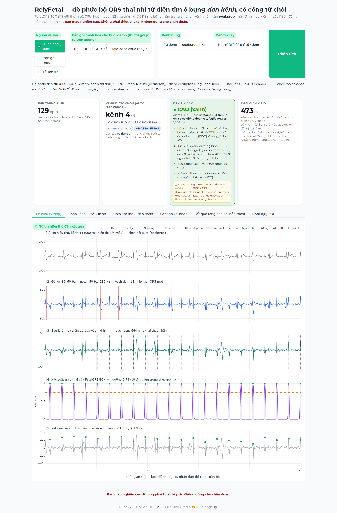
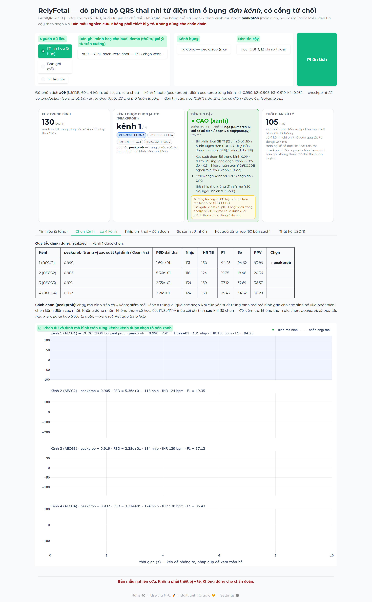

> **Cập nhật vòng 7 (12/09/2026).** Bảng kết quả ở mục 4 dưới đây là lần chạy 32 bản ghi cũ và **có 4 bản
> CinC là bản sao ADFECGDB** (a03, a04, a05, a08 — F1 = 100 vì là dữ liệu huấn luyện). Lần chạy hiện hành
> `results/demo_check_2modes.json` (lần đầu 12/09 17:07; tệp hiện trên đĩa là lần chạy lại 13/09 23:13, `torch_threads` 3, tóm tắt giống hệt; `python demo/run_check.py`, quy tắc kênh `peakprob`,
> loại bản trùng và bản rò rỉ) chấm 82 bản có nhãn (5 ADFECGDB + 60 CinC sạch + 17 Silesia): chế độ *học* —
> 46 xanh (F1 TB 95,70; 3 bản xanh có F1 < 90: a52, a54, a57), 17 vàng, 19 đỏ (F1 TB 54,26), không bản đỏ
> nào có F1 ≥ 95; chế độ *luật* — 58 xanh (97,79; 5 bản xanh có F1 < 90), 19 vàng, 5 đỏ (`summary_by_mode`).
> Bảng mục 4 giữ để truy vết.

# RelyFetal — demo dò phức bộ QRS thai nhi từ điện tim ổ bụng đơn kênh

> **Cập nhật 17/09/2026 — chế độ trình bày.** Mở trang là thấy **5 thẻ**: 4 thẻ bản ghi (r01 · a09 · a02 · a27, bấm thẻ là chạy ngay) và thẻ *Tệp của bạn*,
> và **5 bước** kể chuyện (mỗi lúc một bước, nút Tiếp/Quay lại) cùng **thanh tóm tắt** 6 ô dính đáy màn hình.
> 8 tab cũ vẫn nguyên vẹn trong ô tick **Chế độ chuyên gia** (mặc định tắt). Hướng dẫn: `docs/HUONG_DAN_DEMO_v2.md`;
> phần còn lại của tệp này mô tả 8 tab (hướng dẫn cũ: `docs/HUONG_DAN_DEMO_v1.md`).

> **Bản mẫu nghiên cứu. Không phải thiết bị y tế. Không dùng cho chẩn đoán.**

Demo web một trang (Gradio + Plotly, chạy cục bộ trên CPU) bao bọc đúng pipeline chuẩn của
`model/fqrs_model.py` — *tiền xử lý → khử QRS mẹ → FetalQRS-TCN → chọn đỉnh* — và bổ sung:
chọn kênh mù nhãn theo PSD, chuỗi nhịp tim thai theo cửa sổ 4 s, đối chiếu với nhãn (nếu có)
và một **đèn tin cậy** không cần nhãn với hai chế độ — *học* (GBM trên 12 chỉ số của từng đoạn 4 s — 2 trong đó là xác suất đầu ra của mạng, nên đèn không độc lập với mạng; `fsqi/gate.py`, mặc định)
và *luật* (quy tắc cứng) — kiểm chứng trên **82 bản ghi có nhãn** không rò rỉ (hộp đầu trang, `results/demo_check_2modes.json`; bảng 32 bản cũ ở mục 4 giữ để truy vết).
Chọn kênh mù nhãn mặc định là **peakprob** (quy tắc hậu kiểm — xem README gốc); PSD (Power-MF) có trên giao diện để so sánh.

## 1. Cách chạy

```bash
pip install gradio plotly            # đã kiểm với gradio 6.26.0, plotly 7.0.0 (Python 3.12.6, torch 2.13.0+cpu)
python demo/app.py                   # mở http://127.0.0.1:7860
```

| Biến môi trường | Ý nghĩa | Mặc định |
|---|---|---|
| `RELYFETAL_PORT` | cổng HTTP | `7860` |
| `RELYFETAL_AUTORUN` | `1` = mở trang là tự chạy thẻ đầu tiên (r01) ở chế độ trình bày | `1` |
| `RELYFETAL_AUTORUN_EXPERT` | `1` = 8 tab chuyên gia cũng tự chạy r01 lúc mở (mặc định tắt cho đỡ chạy hai lần) | `0` |
| `PYTHONIOENCODING` | trên Windows nên đặt `utf-8` để in tiếng Việt ra console | — |

Dữ liệu mẫu được tìm qua `benchmark_dpss/_paths.py` (ADFECGDB r01/r04/r07/r08/r10 dạng EDF 1000 Hz;
CinC 2013 set-a a01..a10 dạng WFDB 1000 Hz). Không có dữ liệu mẫu thì vẫn chạy được với file tải lên.
Checkpoint: `model/checkpoints/fetalqrs_tcn_fold_rXX.pt` (dùng cho ADFECGDB rXX — **fold chưa từng thấy rXX**)
và `fetalqrs_tcn_production.pt` (mọi bản ghi khác, kể cả CinC 2013 = zero-shot).

**Tải lên file:** `.edf` (kèm `.edf.qrs` nếu có nhãn) · `.hea + .dat` (+ `.fqrs`) · `.csv` / `.npy` / `.txt`
(mảng K×N hoặc N×K; cần nhập fs) · nhãn tuỳ chọn dạng `.txt` mỗi dòng một chỉ số mẫu.

## 2. Cấu trúc

| Tệp | Vai trò |
|---|---|
| `core.py` | **Lõi xử lý, không phụ thuộc gradio.** Đọc bản ghi (EDF/WFDB/CSV/NPY/mảng) → 1000 Hz; `select_lead` (PSD Power-MF, mù nhãn); `analyze`/`analyze_record` gọi `M.preprocess`, `M.cancel_maternal`, `M.probability_series`, `M.pick_peaks` của `model/fqrs_model.py`; `fhr_series`; `match_with_lists` (ghép một-đối-một, ±50 ms, giống `M.match_events`); `confidence_rule` / `confidence_learned` (đèn tin cậy, hai chế độ — mục 4); `summary` (JSON). Không sửa gì trong `model/`. |
| `app.py` | Giao diện Gradio: hàng điều khiển (nguồn: *Minh hoạ (5 bản)* / *Bản ghi mẫu* / *Tải lên*; kênh: peakprob / PSD / 1–4; chế độ đèn; nút *Phân tích*), 4 thẻ số, 6 tab (*Tín hiệu 5 tầng*, *Chọn kênh — cả 4 kênh*, *Nhịp tim thai + đèn đoạn*, *So sánh với nhãn*, *Kết quả tổng hợp (60 bản sạch)* — đọc từ `analysis/dulieu_results.json`, không ghi cứng số, *Nhật ký JSON*). Chỉ dựng giao diện và vẽ Plotly; mọi tính toán ở `core.py`. Tự thích nghi Gradio 5/6 (`css`/`theme` chuyển sang `launch()` ở Gradio 6). |
| `test_core.py` | Kiểm thử pytest cho lõi (không cần gradio; 66 kiểm thử, toàn repo 109 cùng 43 trong `tests/`, đếm bằng `pytest --collect-only` 17/09/2026; số tăng theo các vòng sửa demo), gồm hai mốc bắt buộc chạy ở **cả hai** chế độ đèn (`luat` và `hoc`): r01 kênh 4 F1 > 99 & đèn *cao*; a02 đèn *không cao*. |
| `run_check.py` | `--mode hoc / luat / ca_hai`, `--threads N`, `--lead peakprob / psd`, `--only r01,a09,…`, `--include-leak`, `--no-silesia`. Chạy lõi trên 82 bản ghi có nhãn (5 ADFECGDB + 60 CinC sạch + 17 Silesia qua `model/silesia_loader.py`; 15 bản CinC rò rỉ bị loại mặc định; chọn kênh tự động) + r01 kênh 4, chấm đèn ở cả hai chế độ → `results/demo_check_2modes.json` + `.log` (hộp đầu trang). JSON được ghi lại sau mỗi bản ghi. |
| `smoke_app.py` | Khởi động thử app không mở trình duyệt: HTTP 200, gọi thẳng `app.run()` với r01, gọi qua `gradio_client` API `/run` → `results/smoke_app.json`. |
| `screenshot.py` | Chụp 12 ảnh giao diện thật theo kịch bản 5 bản minh hoạ bằng playwright/Chromium → `screenshots/` + `screenshots.json` (thời gian thật từng bản). **Viết cho bố cục 8 tab cũ** (dropdown ở đầu trang); từ 17/09 phải bật *Chế độ chuyên gia* trước, script này chưa được sửa. |
| `screenshot_v2.py` | Chế độ trình bày: khởi động thật, bấm 4 thẻ, đi hết 5 bước, ghi thời gian và chụp 7 ảnh `17..23` → `screenshots/screenshots_v2.json`. |
| `results/` | `demo_check_2modes.json` / `.log` (82 bản ghi + r01 kênh 4, hai chế độ đèn, 13/09/2026 23:13, 3 luồng — hộp đầu trang), `demo_check_showcase.json` (5 bản minh hoạ — bảng ở `docs/HUONG_DAN_DEMO_v1.md` mục 6; chế độ trình bày đọc F1 và tỉ lệ bám mẹ của 4 thẻ từ tệp này), `demo_check.json` / `.log` (lần chạy 15 bản ghi mẫu cũ, 4 luồng — nguồn số thời gian ở mục 2), `smoke_app.json`. |
| `screenshots/` | 12 ảnh PNG theo kịch bản 5 bản minh hoạ + `screenshots.json` (mục 6). Bộ ảnh cũ (6 ảnh, mô hình 5 ca, PSD) đã chuyển sang `archive/demo_screenshots_v1/`. |
| `_uploads/` | thư mục tạm cho file tải lên (tự tạo, tự xoá khi tải file mới). |

**Thời gian xử lý** hiển thị trên thẻ = tiền xử lý + khử mẹ của kênh được chọn + mô hình + chọn đỉnh
(không tính đọc file và vẽ); CPU 4 luồng (`torch.set_num_threads(4)`). Bản ghi 300 s: ≈ 0,57–0,76 s;
bản ghi 60 s: ≈ 0,12–0,16 s (lần chạy sạch cuối, `results/demo_check.json`). Toàn bộ chu trình kể cả đọc EDF và dựng hình r01: ≈ 1,8–2,1 s (`results/smoke_app.json`).
Chế độ đèn *học* tốn thêm ≈ 8–40 ms mỗi đoạn 4 s (trung vị 12,7 ms trên 83 hàng; `gate_ms / n_seg` trong
`results/demo_check_2modes.json → rows.*.confidence.components`, 3 luồng, 13/09, máy bận). Bản r01 (300 s, 75 đoạn): 1.041 ms
trong `results/demo_check_showcase.json` (2 luồng, 12/09) và 2.963 ms trong `demo_check_2modes.json` — hiển thị riêng cạnh
điểm đèn, không tính vào thẻ thời gian xử lý. *(Sửa 17/09: bản trước ghi "11–23 ms, trung vị 15 ms, 2 luồng, ≈ 1–1,7 s", không
mở lại được từ tệp hiện có vì `demo_check_2modes.json` đã bị ghi đè bằng lần chạy 13/09.)*

## 3. Quy trình trong demo (những gì người xem thấy trên tab *Tín hiệu*)

1. **Tín hiệu thô** kênh bụng đã chọn (1000 Hz).
2. **Lọc 10–60 Hz + notch 50 Hz, 250 Hz**; vạch đỏ = đỉnh R mẹ do `cancel_maternal` tìm được.
3. **Phần dư sau khử mẹ** (mẫu trung vị) — chính là đầu vào của mô hình; vạch đen = nhãn nhịp thai (nếu có).
4. **Xác suất nhịp thai** của FetalQRS-TCN (113 481 tham số) và ngưỡng cố định từ tập validation.
5. **Kết quả**: ● TP (xanh), ✕ FP (đỏ), ▲ FN (cam) khi có nhãn; hoặc vạch xanh = nhịp mô hình phát hiện khi không có nhãn.

Chọn kênh *Tự động — peakprob* (mặc định): chạy mô hình trên cả 4 kênh, điểm mỗi kênh = trung vị (qua các đoạn 4 s) của xác suất
trung bình tại các đỉnh mô hình vừa phát hiện; không dùng nhãn (`analysis/chonkenh_rules.py`). Đây là quy tắc **hậu kiểm** (quy tắc
khai báo trước là *gate*, trượt Holm) — giao diện và tab *Kết quả tổng hợp* ghi rõ. *Tự động — PSD (Power-MF)*: khử mẹ trên cả 4 kênh,
lấy kênh có đỉnh PSD mạnh nhất trong dải 1,8–3,0 Hz (108–180 bpm) của đường bao phần dư (sao chép từ `benchmark_dpss/blind_lead.py`).

## 4. Đèn tin cậy — hai chế độ (`confidence_mode`)

Đèn trả lời câu hỏi *"có nên tin chuỗi nhịp thai mà mô hình vừa đưa ra không"* mà **không dùng nhãn**.
Demo có hai chế độ, chọn trên giao diện (ô *Đèn tin cậy*) hoặc bằng `core.analyze_record(rec, confidence_mode=...)`:

| Chế độ | Cách tính | Nguồn / bằng chứng |
|---|---|---|
| **`hoc` (mặc định)** | Mỗi đoạn 4 s: 12 chỉ số (SampEn, kurtosis, entropy phổ, tỉ số năng lượng 10–60 Hz, CV RR, tỉ lệ RR hợp lý, bSQI, số đỉnh, đỉnh PSD dải thai, τ ACF, xác suất trung bình tại đỉnh, xác suất cực đại). **Không độc lập với mạng:** hai chỉ số cuối là xác suất đầu ra của mạng; CV RR, tỉ lệ RR hợp lý, bSQI, số đỉnh tính trên nhịp do mạng tìm ra; chỉ số quan trọng nhất là CV RR (ΔAUROC hoán vị 0,140, kế đến xác suất trung bình tại đỉnh 0,032 — `analysis/gate22_results.json → cong.permutation_importance_delta_auroc`) → HistGradientBoosting → `p_bad` = P(F1 đoạn < 80). Đoạn **xanh** nếu `p_bad` < 0,052, **đỏ** nếu > 0,540 (phân vị 85 % / 95 % của xác suất *ngoài fold* trên ADFECGDB), còn lại vàng. Bản ghi: > 30 % đoạn đỏ ⇒ **thấp**; > 70 % đoạn xanh ⇒ **cao**; còn lại **trung bình**; điểm = 1 − TB `p_bad`. | `fsqi/gate.py` + `fsqi/gate_classical.pkl`, huấn luyện bởi `fsqi/train_gate.py` trên 1 500 đoạn ADFECGDB (checkpoint fold; 71 đoạn xấu = 4,7 %). AUROC đoạn: ADFECGDB ngoài fold 0,90 (TB 4 fold), CinC zero-shot gộp 0,93 (`fsqi/gate_meta.json`) — số gộp này tính trên a01–a10, mẫu có 4 bản nhiễm (a03 a04 a05 a08); AUROC **trong bản ghi** của cổng này là 0,721 [0,517; 0,898], trung bình 5 bản có cả đoạn tốt lẫn xấu (`analysis/STATS.md` §4). Con số 0,934 là của cổng 22 ca trong `analysis/GATE22.md`, **chưa chạy trong demo**. Không có đặc trưng tô-pô (kết quả phủ định, `fsqi/results.json`). |
| `luat` | Quy tắc cứng 4 thành phần + ngưỡng đặt tay (bảng dưới), phiên bản đầu của demo | `core.CONF_RULE` |
| `ca_hai` | Tính cả hai; `out['confidence_by_mode'][chế_độ]`, `out['confidence']` = học | dùng bởi `run_check.py` |

Ở **cả hai** chế độ, cổng **bám nhịp mẹ** ghi đè: nếu ≥ 60 % nhịp thai phát hiện nằm trong ±50 ms của một đỉnh R mẹ
(hai nhịp độc lập trùng ngẫu nhiên ≈ 13–22 %) ⇒ **thấp** bất kể điểm. Cổng này được thêm sau khi thấy a02 (CinC):
mô hình bám phần dư QRS mẹ ở ~125 bpm mà bốn thành phần của luật vẫn cho 0,87.

**Chế độ `luat`** — ngưỡng cố định trước, `score = 0,20·s_band + 0,30·s_rr + 0,30·s_prob + 0,20·s_fhr`:

| # | Thành phần (không cần nhãn) | Cách cho điểm |
|---|---|---|
| (i) | tỉ lệ năng lượng 10–60 Hz trên phần dư **băng rộng** (0,5–120 Hz) sau khử mẹ | 0 tại ≤ 20 %, 1 tại ≥ 55 %, tuyến tính ở giữa |
| (ii) | CV của khoảng RR thai đầu ra | 1 tại ≤ 0,05, 0 tại ≥ 0,30 |
| (iii) | tỉ lệ đỉnh phát hiện có xác suất > 0,9 | chính tỉ lệ đó |
| (iv) | fHR trung bình trong 100–200 bpm | 1 / 0 |
| (v) | cổng bám nhịp mẹ (như trên) | > 60 % ⇒ **thấp** |

Mức: `score ≥ 0,75` và (iv) đúng ⇒ **cao**; `≥ 0,45` ⇒ **trung bình**; còn lại hoặc < 10 nhịp hoặc (v) ⇒ **thấp**.

### 4.1 Kết quả trên 32 bản ghi có nhãn — LƯU TRỮ (lần chạy 12/09, tệp nguồn đã bị ghi đè)

> **⚠ Bảng lưu trữ, không mở lại được từ đĩa.** Bảng dưới đây lấy từ lần chạy 32 bản ngày 12/09. Tệp ghi trong tiêu đề cũ,
> `results/demo_check_2modes.json` / `.log`, nay là lần chạy 83 lần phân tích ngày 13/09 (23:13, `torch_threads` 3), nên các
> số trong bảng **không** truy được về tệp đó: ví dụ bảng ghi a02 F1 21,75 và a09 16,96, còn tệp hiện hành và chế độ trình
> bày dùng a02 24,91 và a09 94,25 (quy tắc `peakprob`). **a03 a04 a05 a08 là bản sao dữ liệu huấn luyện ADFECGDB**, không phải
> ngoài miền: F1 100 ở các hàng đó không phải kết quả "production, zero-shot". Số hiện hành: xem hộp cập nhật đầu tệp.
> Mô tả dưới đây giữ nguyên văn để truy vết.

`python demo/run_check.py --mode ca_hai --threads 2` — chọn kênh tự động (PSD), nhãn chỉ dùng để chấm F1 *sau* khi phân tích; 2,3 phút.
32 bản ghi = **5 ADFECGDB** (checkpoint fold rXX, 300 s, nhãn da đầu) + **10 CinC 2013 set-a** (production, zero-shot, 60 s)
+ **17 Silesia** (production, zero-shot; nạp qua `model/silesia_loader.py`): B1_01..10 thai kỳ 20 phút với **nhãn gián tiếp**
(không có điện cực da đầu) và B2_03, 04, 05, 06, 08, 09, 12 chuyển dạ 5 phút, nhãn da đầu. Loại B2_01, 02, 07, 10, 11 vì chính là
r01, r10, r04, r07, r08 của ADFECGDB (NCC 0,988–0,994, `benchmark_dpss/silesia_eval.json`).
Lần chạy này dùng 2 luồng CPU trong lúc máy đang chạy việc khác, nên cột thời gian của nó không so sánh được với mục 2.

| Bản ghi | Bộ dữ liệu | Checkpoint | Kênh | Nhịp | fHR | **F1** | Se | PPV | Đèn học | Điểm học | Đèn luật | Điểm luật | Bám mẹ |
|---|---|---|--:|--:|--:|--:|--:|--:|---|--:|---|--:|--:|
| r01 | ADFECGDB | fold r01 | 4 | 644 | 129,1 | **100,00** | 100,00 | 100,00 | xanh | 0,999 | xanh | 0,858 | 0,16 |
| r04 | ADFECGDB | fold r04 | 2 | 631 | 126,4 | **99,76** | 99,68 | 99,84 | xanh | 0,970 | vàng | 0,744 | 0,15 |
| r07 | ADFECGDB | fold r07 | 2 | 627 | 125,5 | **100,00** | 100,00 | 100,00 | xanh | 0,999 | xanh | 0,800 | 0,13 |
| r08 | ADFECGDB | fold r08 | 4 | 652 | 130,5 | **99,77** | 99,85 | 99,69 | xanh | 0,980 | xanh | 0,896 | 0,20 |
| r10 | ADFECGDB | fold r10 | 1 | 662 | 132,0 | **96,54** | 98,43 | 94,71 | vàng | 0,820 | xanh | 0,917 | 0,14 |
| a01 | CinC 2013 | production | 2 | 122 | 129,8 | **59,18** | 54,48 | 64,75 | đỏ | 0,304 | vàng | 0,572 | 0,23 |
| a02 | CinC 2013 | production | 2 | 125 | 125,8 | **21,75** | 19,38 | 24,80 | đỏ (bám mẹ) | 0,602 | đỏ (bám mẹ) | 0,872 | 0,97 |
| a03 | CinC 2013 | production | 1 | 128 | 128,0 | **100,00** | 100,00 | 100,00 | xanh | 0,915 | xanh | 0,994 | 0,16 |
| a04 | CinC 2013 | production | 4 | 129 | 130,9 | **100,00** | 100,00 | 100,00 | xanh | 0,995 | xanh | 0,937 | 0,16 |
| a05 | CinC 2013 | production | 4 | 129 | 129,0 | **100,00** | 100,00 | 100,00 | xanh | 0,999 | xanh | 0,945 | 0,19 |
| a06 | CinC 2013 | production | 1 | 116 | 121,6 | **42,75** | 36,88 | 50,86 | đỏ | 0,108 | vàng | 0,482 | 0,41 |
| a07 | CinC 2013 | production | 2 | 98 | 115,4 | **29,82** | 26,15 | 34,69 | đỏ | 0,052 | vàng | 0,483 | 0,37 |
| a08 | CinC 2013 | production | 4 | 128 | 127,6 | **100,00** | 100,00 | 100,00 | xanh | 0,993 | xanh | 1,000 | 0,25 |
| a09 | CinC 2013 | production | 2 | 94 | 96,2 | **16,96** | 14,62 | 20,21 | đỏ (bám mẹ) | 0,547 | đỏ (bám mẹ) | 0,266 | 0,89 |
| a10 | CinC 2013 | production | 2 | 110 | 117,5 | **21,05** | 17,14 | 27,27 | đỏ | 0,088 | vàng | 0,629 | 0,57 |
| B1_01 | Silesia B1 thai kỳ | production | 3 | 3056 | 155,6 | **97,70** | 96,70 | 98,72 | vàng | 0,784 | xanh | 0,818 | 0,16 |
| B1_02 | Silesia B1 thai kỳ | production | 3 | 2799 | 140,5 | **99,59** | 99,50 | 99,68 | vàng | 0,861 | xanh | 0,884 | 0,17 |
| B1_03 | Silesia B1 thai kỳ | production | 3 | 2566 | 128,6 | **99,86** | 99,88 | 99,84 | xanh | 0,962 | xanh | 0,981 | 0,17 |
| B1_04 | Silesia B1 thai kỳ | production | 3 | 2765 | 139,1 | **99,80** | 99,64 | 99,96 | xanh | 0,971 | xanh | 0,975 | 0,15 |
| B1_05 | Silesia B1 thai kỳ | production | 3 | 2768 | 138,9 | **99,78** | 99,75 | 99,82 | xanh | 0,987 | xanh | 0,999 | 0,22 |
| B1_06 | Silesia B1 thai kỳ | production | 4 | 2686 | 140,4 | **80,90** | 78,05 | 83,95 | đỏ | 0,454 | vàng | 0,664 | 0,22 |
| B1_07 | Silesia B1 thai kỳ | production | 4 | 2530 | 134,7 | **58,72** | 53,21 | 65,49 | đỏ | 0,124 | đỏ | 0,434 | 0,32 |
| B1_08 | Silesia B1 thai kỳ | production | 1 | 2897 | 145,8 | **99,52** | 99,28 | 99,76 | vàng | 0,680 | xanh | 0,885 | 0,14 |
| B1_09 | Silesia B1 thai kỳ | production | 3 | 2859 | 143,5 | **99,04** | 98,92 | 99,16 | vàng | 0,840 | xanh | 0,981 | 0,17 |
| B1_10 | Silesia B1 thai kỳ | production | 3 | 2610 | 131,1 | **98,12** | 98,46 | 97,78 | vàng | 0,768 | xanh | 0,874 | 0,19 |
| B2_03 | Silesia B2 chuyển dạ | production | 1 | 655 | 137,2 | **73,81** | 70,67 | 77,25 | đỏ | 0,408 | vàng | 0,637 | 0,18 |
| B2_04 | Silesia B2 chuyển dạ | production | 1 | 685 | 137,3 | **98,39** | 98,68 | 98,10 | vàng | 0,786 | xanh | 0,964 | 0,14 |
| B2_05 | Silesia B2 chuyển dạ | production | 4 | 660 | 132,5 | **100,00** | 100,00 | 100,00 | xanh | 0,973 | xanh | 0,957 | 0,17 |
| B2_06 | Silesia B2 chuyển dạ | production | 1 | 684 | 136,7 | **100,00** | 100,00 | 100,00 | vàng | 0,828 | xanh | 1,000 | 0,14 |
| B2_08 | Silesia B2 chuyển dạ | production | 4 | 645 | 129,0 | **100,00** | 100,00 | 100,00 | xanh | 0,996 | xanh | 1,000 | 0,18 |
| B2_09 | Silesia B2 chuyển dạ | production | 1 | 673 | 134,8 | **99,03** | 98,96 | 99,11 | vàng | 0,786 | xanh | 0,992 | 0,15 |
| B2_12 | Silesia B2 chuyển dạ | production | 4 | 657 | 131,4 | **99,85** | 99,85 | 99,85 | xanh | 0,971 | xanh | 0,999 | 0,21 |
| r01 (kênh 4 thủ công) | ADFECGDB | fold r01 | 4 | 644 | 129,1 | **100,00** | 100,00 | 100,00 | xanh | 0,999 | xanh | 0,858 | 0,16 |

Chỉ số theo dung sai ±50 ms, ghép một-đối-một. F1 của mô hình không phụ thuộc chế độ đèn (đèn chỉ *đọc* đầu ra); ba nhóm dữ liệu
đều có bản ghi mô hình thất bại (a01–a02, a06–a07, a09–a10; B1_06–07; B2_03) — đèn phải bắt được chúng.

### 4.2 Đèn tách được bản ghi tốt / xấu ở mức nào (32 bản ghi, chọn kênh tự động)

| Chế độ | Đèn | Số bản ghi | F1 trung bình | F1 min | F1 max |
|---|---|--:|--:|--:|--:|
| **`hoc`** | xanh | 14 | **99,92** | 99,76 | 100,00 |
| | vàng | 9 | 98,66 | 96,54 | 100,00 |
| | đỏ | 9 | 44,99 | 16,96 | 80,90 |
| `luat` | xanh | 22 | **99,41** | 96,54 | 100,00 |
| | vàng | 7 | 58,18 | 21,05 | 99,76 |
| | đỏ | 3 | 32,48 | 16,96 | 58,72 |

| Tiêu chí | `hoc` | `luat` |
|---|--:|--:|
| **xanh nhưng F1 < 90 — lỗi nguy hiểm** | **0** | **0** |
| đỏ nhưng F1 ≥ 95 — lỗi thận trọng | 0 | 0 |
| macro F1 nhóm xanh @ độ phủ xanh | **99,92** @ 43,8 % | 99,41 @ **68,8 %** |
| macro F1 nhóm xanh + vàng @ độ phủ | **99,42** @ 71,9 % | 89,46 @ **90,6 %** |
| F1 thấp nhất trong nhóm *không đỏ* | **96,54** | 21,05 |
| F1 cao nhất trong nhóm đỏ | 80,90 | 58,72 |
| Spearman(điểm, F1) | **0,90** | 0,71 |
| macro F1 mọi bản ghi (không phụ thuộc đèn) | 84,12 | 84,12 |

Trên các tập con (tính từ cùng JSON): **17 Silesia** — tập duy nhất không dính dáng gì tới việc huấn luyện GBM (ADFECGDB)
hay việc đặt cổng bám mẹ của luật (a02): `hoc` xanh 6/17 (F1 TB 99,88, min 99,78), vàng 8 (98,92; 97,70–100), đỏ 3 (71,14; max 80,90);
`luat` xanh 14/17 (99,33, min 97,70), vàng 2 (73,81 và 80,90), đỏ 1 (58,72). **27 bản ghi ngoài ADFECGDB**: `hoc` xanh 10 (99,93, min 99,78)
@ 37,0 %, đỏ 9 (max 80,90); `luat` xanh 18 (99,48, min 97,70) @ 66,7 %, vàng 6 (21,05–80,90). Lưu ý GBM cuối cùng được huấn luyện trên toàn bộ
1 500 đoạn ADFECGDB (ngưỡng đoạn hiệu chuẩn ngoài fold), nên 4/5 đèn xanh của `hoc` trên ADFECGDB là *in-sample* và lạc quan.

16/32 bản ghi hai chế độ cho đèn khác nhau, và chúng chia làm đúng hai nhóm:
* `hoc` đỏ nhưng `luat` vàng — **6 bản ghi mô hình thất bại**: a01 (59,18), a06 (42,75), a07 (29,82), a10 (21,05), B1_06 (80,90), B2_03 (73,81).
* `hoc` vàng nhưng `luat` xanh — **9 bản ghi mô hình tốt**: r10 (96,54), B1_01 (97,70), B1_02 (99,59), B1_08 (99,52), B1_09 (99,04), B1_10 (98,12), B2_04 (98,39), B2_06 (100,00), B2_09 (99,03); ngược lại r04 (99,76) `hoc` xanh / `luat` vàng.

### 4.3 Chế độ mặc định: `hoc` — và giá phải trả

Giữ **`hoc`** làm mặc định (`core.CONFIDENCE_MODE_DEFAULT`), vì theo thứ tự tiêu chí đã đặt trước: (1) lỗi nguy hiểm hoà 0–0;
(2) macro F1 nhóm xanh 99,92 > 99,41; (3) quan trọng hơn với một đèn *an toàn*: mức **vàng** của `hoc` thực sự nghĩa là
"tốt nhưng hãy kiểm tra" (thấp nhất 96,54), còn vàng của `luat` trộn lẫn F1 21 với F1 99,76 — người xem thấy "trung bình" trên một
bản ghi F1 = 21 là bị đánh lừa; `hoc` đưa 6 bản ghi thất bại đó xuống đỏ. Điểm của `hoc` cũng đơn điệu hơn theo F1 (Spearman 0,90 so với 0,71).

Giá phải trả — nói thẳng: `hoc` **thận trọng quá mức**, hạ 9 bản ghi F1 96,5–100 xuống vàng, nên độ phủ xanh chỉ 43,8 % (68,8 % với luật);
trên Silesia B1 (thai kỳ, nhãn gián tiếp) chỉ 3/10 xanh trong khi 8/10 có F1 ≥ 97,7. Nếu chỉ xét 17 bản ghi Silesia thì `luat` có
cùng 0 lỗi nguy hiểm mà phủ xanh gấp đôi (82,4 % so với 35,3 %) — ở đó luật tốt hơn. Nguyên nhân có thể là ngưỡng đoạn/bản ghi
(q1, q2, 70 %/30 %) hiệu chuẩn trên ADFECGDB chuyển dạ với checkpoint fold, trong khi production checkpoint trên tín hiệu thai kỳ
20 phút cho `p_bad` trung bình cao hơn. **Không tinh chỉnh** ngưỡng trên 32 bản ghi này (đó là tập kiểm tra); muốn nâng độ phủ
phải hiệu chuẩn lại trên dữ liệu khác rồi chạy lại `run_check.py`. Chế độ `luat` vẫn chọn được trên giao diện khi cần độ phủ.

## 5. Kịch bản demo 3 phút

Kịch bản 5 phút theo 4 thẻ ở `docs/HUONG_DAN_DEMO_v2.md`; kịch bản đầy đủ 8–10 phút với 5 bản minh hoạ (r01, a09, B2_03, a02, a27) ở `docs/HUONG_DAN_DEMO_v1.md`; con số dưới đây
lấy từ `results/demo_check_showcase.json` (mô hình 22 ca, peakprob, 2 luồng).

| Phút | Thao tác | Điều cần nói |
|---|---|---|
| 0:00–0:30 | Mở `python demo/app.py`; trang tự phân tích **r01**. Chỉ vào 4 thẻ số. | Một kênh bụng, 300 s, 645 nhịp thai, fHR 129 bpm; checkpoint fold 22 ca **chưa từng thấy** r01. Đèn xanh, chế độ học 0,999 (luật 0,861). Thẻ *Thời gian xử lý* hiện hai số: kênh đã chọn ≈ 0,4 s và cả 4 kênh ≈ 2 s (chi phí thật của peakprob). |
| 0:30–1:30 | Tab **Tín hiệu (5 tầng)**: kéo chuột phóng to 2–3 giây; chỉ vạch đỏ (mẹ) ở tầng 2, phần dư tầng 3, xác suất tầng 4, TP ở tầng 5. | QRS mẹ lớn gấp ~3 lần QRS thai; sau khử mẹ mô hình chỉ còn nhìn phần dư; ngưỡng cố định từ validation, không chỉnh theo bản ghi. |
| 1:30–2:00 | Tab **So sánh với nhãn**. | Se/PPV/F1 = 100,00 / 99,84 / 99,92 với dung sai ±50 ms; jitter 1,47 ms. |
| 2:00–2:30 | Chọn **a09 — CinC sạch** → *Phân tích*; tab **Chọn kênh — cả 4 kênh**. | Zero-shot. peakprob chọn kênh 1 (F1 94,25); kênh 2 — kênh PSD sẽ chọn — chỉ 19,35. Đổi *Kênh bụng* sang *PSD* để thấy đèn đỏ. Nói rõ: peakprob là quy tắc hậu kiểm, +7,73 trên 60 bản sạch là giả thuyết chưa nhân rộng; báo đủ — PSD 74,28, gate 80,72 (quy tắc kế hoạch chọn trước khi chạy, trượt Holm p 0,051), gate4 81,01 (cũng ghi trước khi chạy, p_Holm 0,015), peakprob 82,01 (hậu kiểm, p_Holm 0,0039), trần oracle 83,60. |
| 2:30–3:00 | Chọn **a02 — CinC sạch** → *Phân tích*. Kết bằng dòng miễn trừ. | Đèn **đỏ** ở cả hai chế độ: 78 % nhịp "thai" trùng đỉnh R mẹ → mô hình bám mẹ (F1 24,91). Hệ thống phải nói "tôi không chắc". *Bản mẫu nghiên cứu, không dùng cho chẩn đoán.* |

Không dùng a03/a04/a05/a08 (và 11 bản khác) làm ví dụ zero-shot: chúng là bản sao ADFECGDB (`core.CINC_LEAK`), giao diện gắn cờ ⚠ RÒ RỈ.

## 6. Ảnh chụp màn hình (`screenshots/`, playwright 1.62.0 + Chromium, 1500 px × 1,5)

12 ảnh theo đúng kịch bản 5 bản minh hoạ (`docs/HUONG_DAN_DEMO_v1.md` mục 5), chụp bằng `python demo/screenshot.py`
(server tạm ở cổng 7862, 2 luồng CPU). `screenshots.json` ghi thời gian thật từ lúc bấm *Phân tích* đến khi thẻ số đổi.

| Tệp | Nội dung |
|---|---|
| `01_r01_tong_quan.png` | r01: thẻ số (đèn **xanh**, kênh 4/4) + tab *Tín hiệu (5 tầng)* |
| `02_r01_the_so.png` | r01: chỉ 4 thẻ số |
| `03_r01_so_sanh.png` | r01: tab *So sánh với nhãn* |
| `04_a09_chon_kenh.png` | a09: tab *Chọn kênh — cả 4 kênh* (peakprob chọn kênh 1) |
| `05_a09_the_so.png` | a09 peakprob: đèn xanh, F1 94,25 |
| `06_a09_psd_the_so.png` | a09 PSD: kênh 2, đèn đỏ, F1 19,35 |
| `07_B2_03_fhr_den_doan.png` | B2_03: tab *Nhịp tim thai + đèn đoạn* |
| `08_B2_03_the_so.png` | B2_03: đèn ĐỎ chế độ học (luật: xanh — sai) |
| `09_a02_the_so.png` | a02: đèn ĐỎ, bám nhịp mẹ 78 % |
| `10_a02_fhr.png` | a02: tab fHR |
| `11_a27_the_so.png` | a27: đèn ĐỎ, cả bốn dây đều kém (F1 từng dây 21,26–32,94) |
| `12_tong_hop.png` | tab *Kết quả tổng hợp (60 bản sạch)* |





Chụp lại: `pip install playwright && python -m playwright install chromium && python demo/screenshot.py`.

## 7. Kiểm thử

```bash
python -m pytest demo/test_core.py -v     # kiểm thử lõi (≈ 50 s với 2 luồng đo khi còn 17 kiểm thử; số kiểm thử đã tăng; cần dữ liệu mẫu)
python demo/smoke_app.py                  # server + gọi thẳng + gradio_client -> results/smoke_app.json
python demo/run_check.py --mode ca_hai --threads 2   # 83 lần phân tích (82 bản ghi có nhãn + r01 kênh 4), hai chế độ đèn -> results/demo_check_2modes.json / .log (≈ 3 phút)
python demo/run_check.py --only r01,a09,B2_03,a02,a27 --out demo_check_showcase --threads 2   # 5 bản minh hoạ
python demo/run_check.py --mode luat --no-silesia    # tái tạo 15 bản ghi mẫu ở chế độ luật -> results/demo_check_luat.json / .log
```

`smoke_app.py` đi qua đúng đường postprocess của Gradio, nhờ đó đã bắt được một lỗi thật khi lên Gradio 6:
`gr.JSON` (orjson) từ chối khóa kiểu `int` trong `lead_scores` — đã sửa trong `core.summary` (khóa chuỗi).

## 8. Hạn chế

* Đèn tin cậy trên 82 bản ghi có nhãn không rò rỉ (`results/demo_check_2modes.json` → `summary_by_mode`): chế độ học (mặc định)
  46 xanh / 17 vàng / 19 đỏ, **3 bản xanh có F1 < 90** (a52 85,39; a54 38,79; a57 17,02 — a52, a54 thuộc 7 bản nhãn sai đã khai báo trước),
  0 bản đỏ có F1 ≥ 95; chế độ luật 58 / 19 / 5 với 5 bản xanh F1 < 90. Tức là đèn **không** còn "0 lỗi nguy hiểm" như trên 32 bản cũ.
  Ngưỡng của chế độ học hiệu chuẩn trên mô hình 5 ca / ADFECGDB chuyển dạ, chưa hiệu chuẩn lại trên mô hình 22 ca hay thai kỳ;
  cổng 22 ca của `analysis/GATE22.md` chưa được xuất sang demo.
* CinC 2013 là zero-shot với checkpoint production 22 ca: trên **60 bản sạch** F1 trung bình 74,28 (PSD) / 80,72 (gate, quy tắc kế hoạch chọn, trượt Holm) / 81,01 (gate4, cũng ghi trước khi chạy) / 82,01 (peakprob, hậu kiểm), trần oracle 83,60; 16 / 12 / 12 / 9 bản
  F1 < 50 (`analysis/dulieu_results.json` → `chon_kenh_60_sach`); demo cho thấy đúng thực trạng này, không che. Mọi số CinC trên
  mẫu 10 bản hay 75 bản đã rút (README gốc, mục *Retractions*).
* Chỉ hỗ trợ bản ghi ≤ vài phút trong trình duyệt (Plotly WebGL, bản ghi 300 s ở 250 Hz vẽ mượt; thô 1000 Hz hiển thị 1/4 mẫu).
* Chưa có xử lý theo thời gian thực/luồng; mỗi lần bấm phân tích cả bản ghi.

> **Bản mẫu nghiên cứu. Không phải thiết bị y tế. Không dùng cho chẩn đoán.**
